# Elephant's Memory
## A collaborative, private, and digital memory album
### A MERN, full-stack application

[Deployed Page](https://elephantsmemory.herokuapp.com/)

*Goal of this application:*
- A digital memory album with collaborative capabilities, password protection, and multiple post formats
- MVP:
  - Multiple users can contribute to a single album
  - Uploading both pictures with captions and text prompts to an album
  - Ability to add/remove an album password

*To log in using a guest account:*  Email: guestaccount@test.com Password: Password

*Skills utilized:*
- React + Redux 
- Mongoose + MongoDB
- Node.js
- Express.js
- CSS, CSS animations, Reactstrap + Bootstrap
- Cloudinary (sending photos)
- BCrypt + JSON Web Tokens (user authentication)

*Future developments:*
- Fully responsive across all devices
- Password reset + email verification through Nodemailer
- Ability to add tags
- Search functionality
- Filter + refine albums by date, by post type, or by uploader
- View all pictures, text posts, or memories
- Ability to add videos
- Ability to add Spotify samples
- Testing

#### Step-by-step overview of this application: 

When the page loads, users are met with a brief description of the site with a vertically scrolling background. This background is an example of what their own personal memory album could look like.
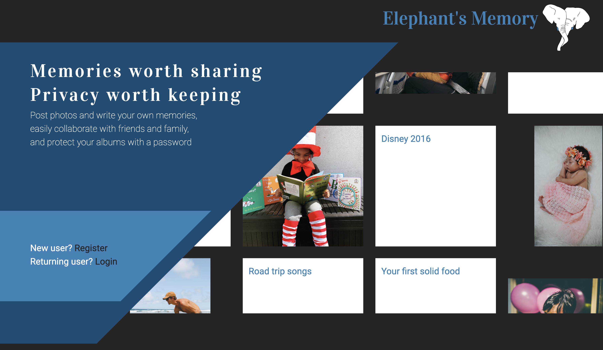
Users then have the option to log in or register with the site by clicking on the grey links to the left of the page 
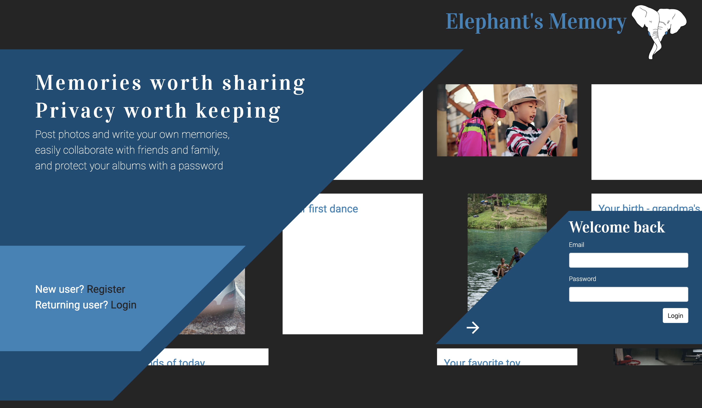
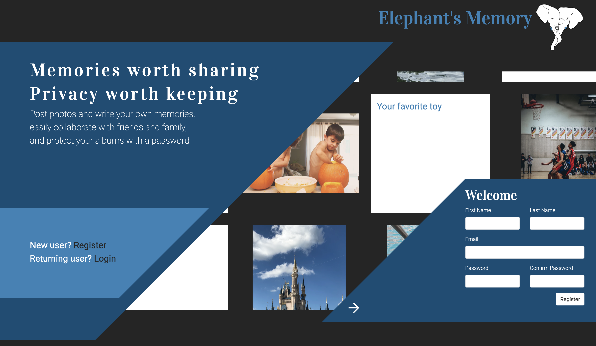
After a user successfully registers or logs in, they are brought to the dashboard of the application. This is where logged-in users can view all of their albums, change album settings, and access their account settings. Notice that when a user is logged in, links appear in the nav bar to the left of the logo. Clicking these links will respectively bring them back to the dashboard, open the account settings page, or log them out of their account. These links are not available to a logged-out user. When a user first registers, their dashboard is empty. 
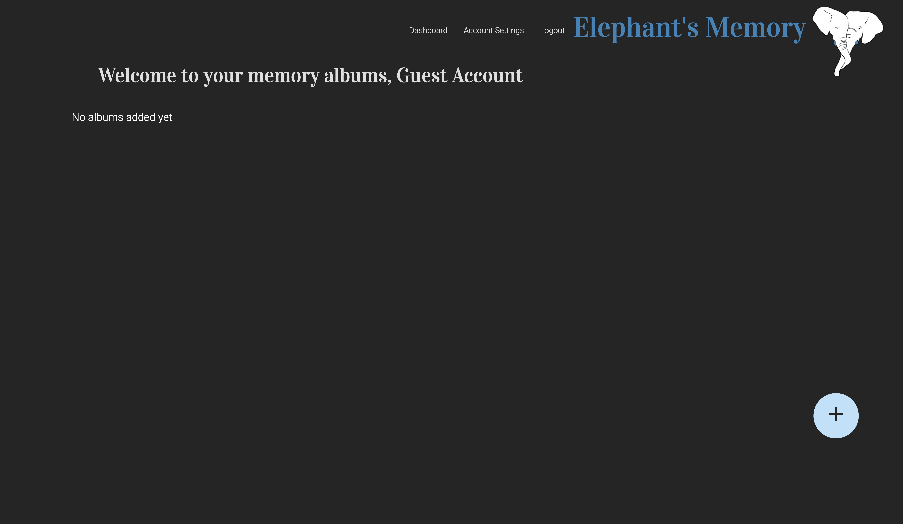
Users can add albums by selecting the 'add' plus sign in the right-hand corner of the page. A modal will then appear and prompt users to create a new album with the option to add a password to protect it. Users can add, update, or delete a password later in the album settings.
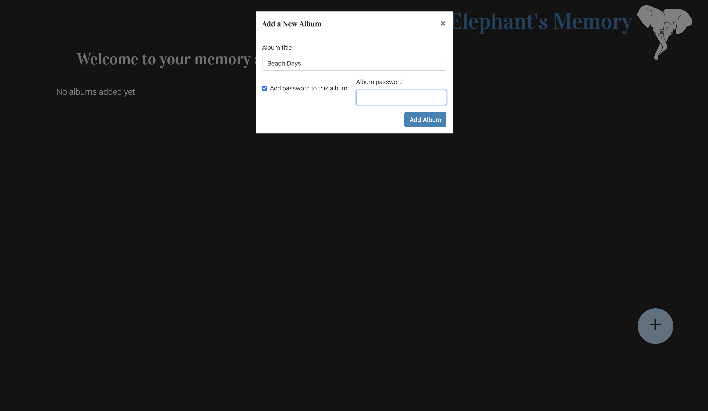
After creation, the album will appear on the user's dashboard. The albums are displayed in reverse chronological order with the most recently added album appearing first.
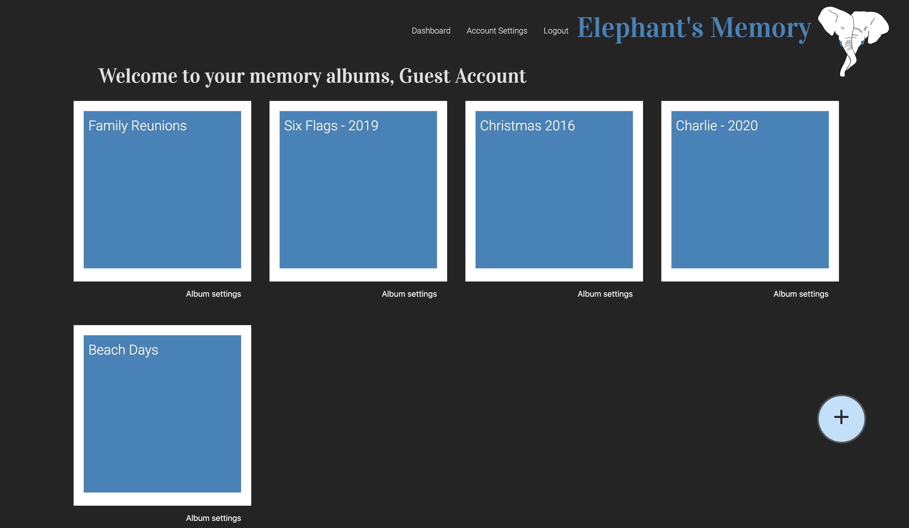
When the logged-in user clicks on an album from their dashboard page, they are redirected to the album memory page. Here, users, and whoever they have given the link and password to, can upload both text and picture memories using the respective buttons on the right-hand side of the page. Both post types are rendered on the page, side-by-side. 
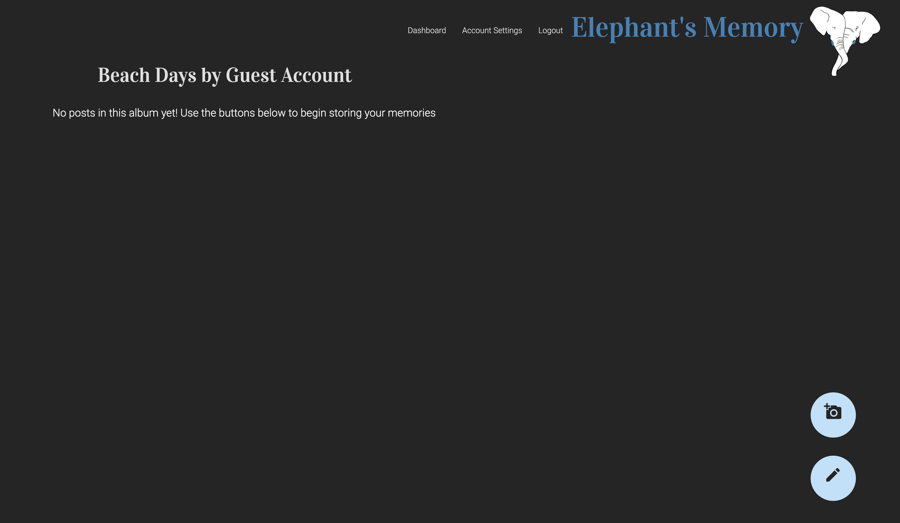

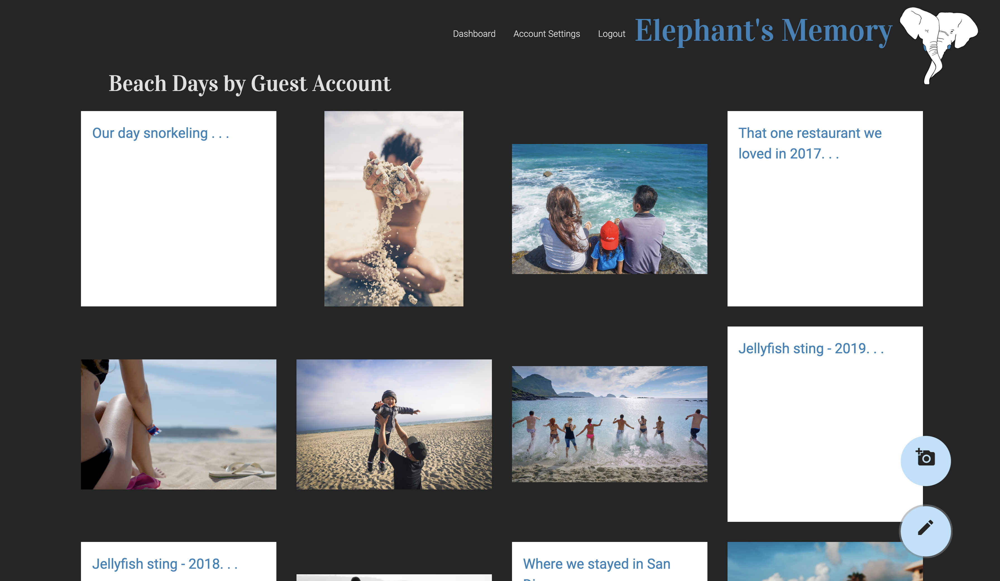
When the user clicks on any memory post, a modal carousel appears showing more information about the memory. When a user is the album creator and is logged in, they have the option to delete a memory post, regardless of who posted it. This action cannot be undone.
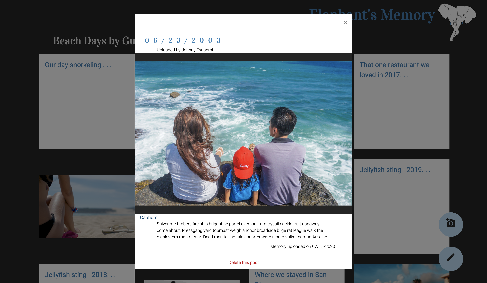

If the album is protected by a password and the album creator is not logged in, the user is unable to see any posts within an album. If the user enters the correct password, they have the ability to add either a text or photo post. Even if a user has the password, they cannot delete a post - that right is exclusively reserved for the album owner - notice that the 'delete' option is removed from the carousel since we are not currently logged in.
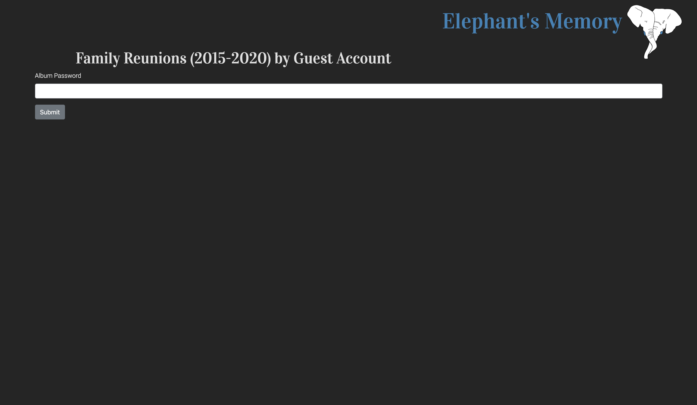
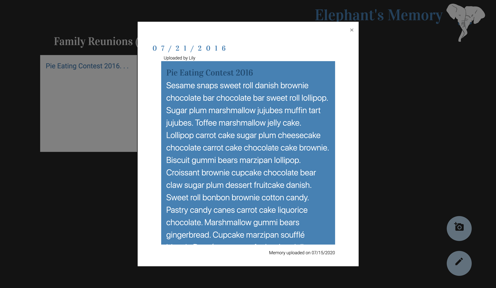
From the dashboard page, logged-in users can update an album title, change album password preferences, or delete the entire album and its contents by clicking 'Album settings' below the desired album.
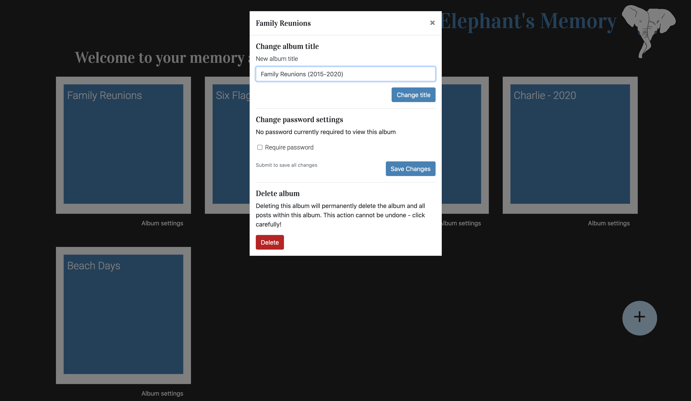
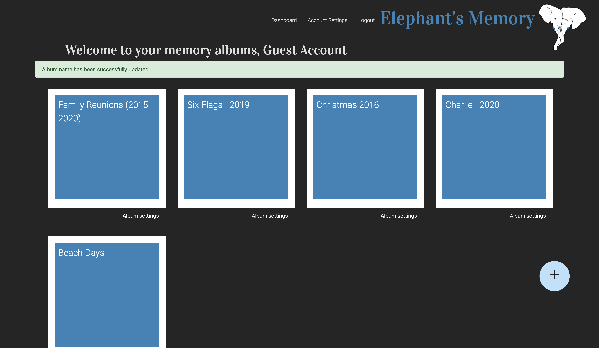
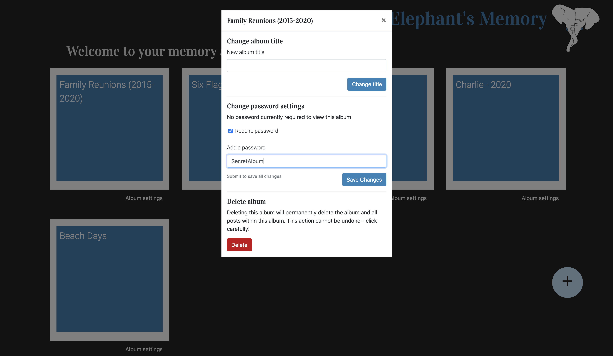
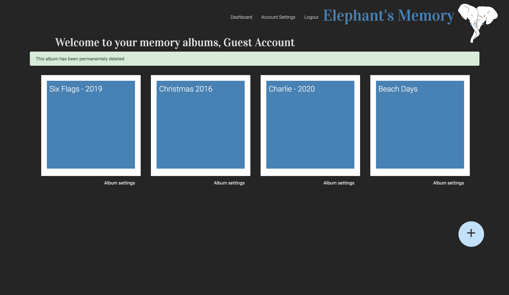
Finally, when a logged-in user clicks 'Account Settings' in the navigation bar, they are brought to their settings page. Here, the user can change their account password or delete their entire account. Account deletion will remove all albums, pictures, and posts within the user's account and cannot be undone.
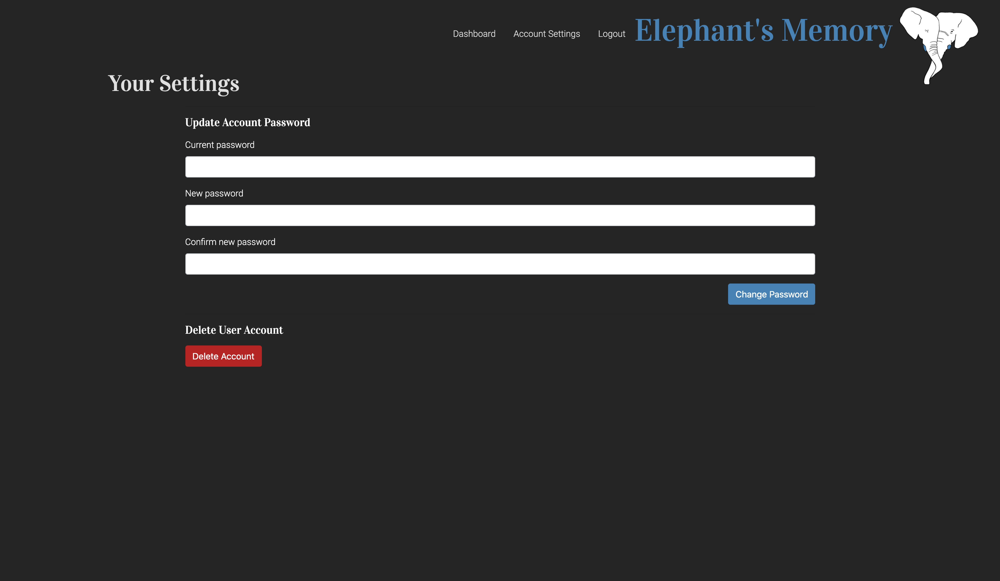
